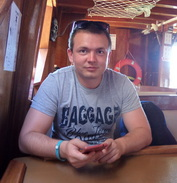

# EVGENY BORISEVICH
 
*ASPIRING WEB DEVELOPER*
## CONTACTS
Minsk, Belarus 
+375 (33) 642-22-45 
evgenyborisevich@inbox.ru  
       
## ABOUT MYSELF
My goal is to gain knowledge and practical skills that will help me realize my dream of becoming a developer. Since I am a beginner web developer, I have no work experience. But I firmly believe that my desire to win and my ability to grasp everything on the fly will bring me success. 
## SKILS
I have basic knowledge of HTML / СSS, JS. Familiarized with SCSS preprocessors. 